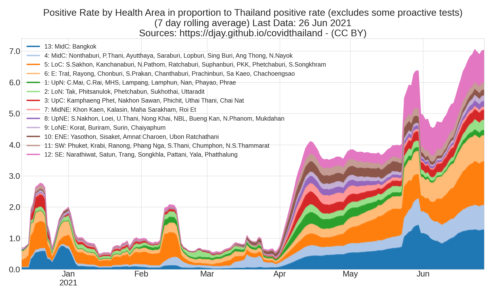

<h1 align="center" id="Covid-19 Thailand Power BI Dashboard">Final Report</h1> 

<h2 align="center" id="Team Members">Team Members</h2>

<b>Table of Contents</b>

<ol class="toc_list">
  <li><a href="#1. User Scenario - The Characters">User Scenario: The Characters</a>
  <ul>
    <li><a href="#Who is our target user?">Who is our target user?</a></li>
    <li><a href="#Why are they important?">Why are they important?</a></li>
    <li><a href="#What problem are we solving for them?">What problem are we solving for them?</a></li>
  </ul>
</li>
<li><a href="#2. Technical Problem - The Setting">Technical Problem: The Setting</a></li>
  <ul>
    <li><a href="#Why does our system exist?">Why does our system exist?</a></li>
    <li><a href="#Core technical problems.">Core technical problems.</a></li>
    <li><a href="#Review of other existing systems that address this problem.">Review of other existing systems that address this problem.</a></li>
  </ul>
<li><a href="#3. Technical Solution - The Plot">Technical Solution: The Plot</a></li>
  <ul>
    <li><a href="#What does our system do?">What does our system do?</a></li>
      <ul>
    	<li><a href="#Example use case - Computer Science student with interest in Python development">Example use case: Computer Science student with interest in Python development</a></li>
      </ul>
     <li><a href="#How does it work? System diagram">How does it work? (System diagram)</a></li>
      <ul>
    	<li><a href="#Front-end: Technologies, User interface components including interface mock-ups.">Front-end: Technologies, User interface components including interface mock-ups</a></li>
    	<li><a href="#Back-end: Technical components.">Back-end: Technical components.</a></li>
   	<li><a href="#Data sources:">Data sources:</a></li>
	<li><a href="#Use Case Diagram.">Use Case Diagram.</a></li>
	<li><a href="#What are the key technical contributions of our solution?">What are the key technical contributions of our solution?</a></li>
       </ul>
  </ul>
 
<li><a href="#4. User Evaluation: The Results">User Evaluation: The Results</a></li>
  <ul>
    <li><a href="#What components of our system are we evaluating and why?">What components of our system are we evaluating and why?</a>     </li>
    <li><a href="#How did we evaluate them (data collected, users involved, evaluation metrics)?">How did we evaluate them (data collected, users involved, evaluation metrics)?</a>
    </li>
    <li><a href="#What have we learned from the evaluation?">What have we learned from the evaluation?</a>
    </li>
  </ul>
	
<li><a href="#5. Conclusion - The Reviews">Conclusion: The Reviews</a></li>
  <ul>
    <li><a href="#Our project management strategy">Our project management strategy</a></li>
    <li><a href="#The biggest challenges we faced as a team during the project and how we addressed them.">The biggest challenges we faced as a team during the project and how we addressed them.</a></li>
    <li><a href="#Key contribution of our project and future extensions to improve our system.">Key contribution of our project and future extensions to improve our system.</a></li>
  </ul>
  
<li><a href="#6. Video DEMO of the System">Video DEMO of the system</a></li>
  
<li><a href="#7. References and Key Resources">References and Key Resources</a></li>
</ol>

<h2 id="1. User Scenario - The Characters">1. User Scenario: The Characters</h2>

<h3 id="Who is our target user?">Who is our target user?</h3>
Our objective is to develop a website which can serve as a go-to place for all the information associated with Information Technology in Ireland. Our target audience were students who are willing to pursue their career in IT related fields. The website we developed can be used by all students to identify top IT skills in the market and the job opportunities related to that skill as well as corresponding events happening around them. Along with this, we are also providing them with latest news and twitter feed related to that skill.  

<i><b>Note:</b> Initially, our target user group was only IT students. But, we realized that there might be students from different background who wish to pursue their careers in IT.</i>

<h3 id="Why are they important?">Why are they important?</h3>
Over the past decade, Ireland has grown into a Global Technology hub. Ireland, being the second largest exporter of computer and IT services in the world, has successfully attracted 9 of the top 10 global Information Technology companies to establish a significant presence here. As a result, there has been a great increase in the number of international students who want to pursue their career in Technology. Also, the figure of incoming international students is expected to rise even more rapidly in coming years. 
 
In the past five years, 25,000 new jobs have been announced by the Tech sector in Ireland. With almost two thousand additional graduates required by the sector every year from 2018. There are massive opportunities for students who pursue relevant third level courses. Hence, our target audience, the student community, is an important aspect in the growth of Ireland.
 

<h3 id="What problem are we solving for them?">What problem are we solving for them?</h3>
At present, there is no all-in-one platform where students could get all the information they need regarding the subject of their interest. Students willing to pursue their careers in Technology face difficulty to realize which skills are in high demand in the Irish market. We wanted to provide them details that would guide them in choosing the modules during their graduate/undergraduate studies. This would also help them study the job market and find the events happening around them related to those skills. They can also connect with like-minded people by attending events in their area.  

Information we will be providing can be divided into four categories:

- 
Events for enhancing skills and networking.

- 
Open job positions and job insights that will help them make educated decisions about their career. 
- 
Most recent news articles related to the skills.

- 
Most recent Twitter feed related to the skills.

In addition, we will provide our users with interactive dashboards containing insights gained from combination of four categories mentioned above. Some of these insights will include visualizations such as: 

- 
 Most popular Meetup group in Ireland.

- 
 Most popular events happening in Ireland.

- 
 Top IT skills in the Irish market. 

- 
 Counties having maximum number of job openings in Ireland. 

- 
 Top companies hiring in Ireland. 

- 
 Top companies in terms of work life balance rating.

- 
 Most popular Job titles in Ireland based on filtered IT skill(s). 

- 
 Highest paid jobs in Ireland based on filtered IT skill(s). 

- 
 Most difficult Job Interviews based on filtered IT skill(s). 

- 
 Top trending IT skills based on the latest News articles being published.

- 
 Trend of number of published News articles related to IT skills. 

<h2 id="2. Technical Problem - The Setting">2. Technical Problem: The Setting</h2>
<h3 id="Why does our system exist?">Why does our system exist?</h3>

At present, there exists no system that can successfully provide IT students with one platform for all their IT related queries. Our system will serve as a “go-to place” for all such queries which will provide Computer Science students with the right tools to help them:

- Discover upcoming events they might be interested in attending,
- Enhance certain skills by
  - attending the event(s) or 
  - by reading News articles or Tweets about that subject,
- Find open job positions which require those skills as well as
  - how difficult was the interview on average and
  - how much they could potentially earn  
- 
Discover the company rating, work life balance and career opportunities of the listed companies from the overall rating given by the employees,

- 
Learn which job positions are most in demand based on selected IT skill.

 

Besides having one platform containing information from all these different sources, our website offers additional valuable information to our users by providing them with interactive dashboard showing interesting details like highly paid jobs, skills in great demand in Ireland, etc. 
 
The existing Meetup website gives good amount of details relating to upcoming IT events happening nearby. But this alone wouldn’t help any student in identifying a skill that is in great demand in Ireland. Glassdoor website, on the other hand, provides information about job postings, company reviews, salaries and interviews, but to get all this information, a user has to navigate throughout the website and do multiple search queries. 

Although, these websites are popular among IT students, we had a vision of developing a platform that will give a bird eye view of IT job market by providing our users with:

- 
Job posts along with respective average salary, company rating, work life balance, career opportunities and interview difficulty. 

- Upcoming events related to selected IT skill and also what other skills will they enhance by attending that event. 
- Relevant twitter feed and news articles retrieved from over 700 News portals. 

In addition to this, we have used Data Analytics and Visualization techniques to provide some useful insights about the job market. We have also incorporated text analytics to discover skills enhanced by attending an event.

<h3 id="Core technical problems.">Core technical problems.</h3>

- 
<b> Demand on a Job Market:</b>  
Initially, we were web scraping only the first page of job postings for a particular skill on Glassdoor to get the job details. Hence, we were unable to determine the exact count of job postings available. Going further, we expanded the logic of extracting job posting from all the pages in order to fetch the exact number of positions for a particular skill in the market.

<ul>
<li> 
<b> Connecting job postings to their average salary, interview difficulty and company overall rating:</b>  
We applied fuzzy matching left join in order to connect web scraped job posts with their corresponding salary, interview difficulty and company overall ratings retrieved from the Glassdoor API. We performed:
	<ul>
	<li> Left join of the Job_Posts table with the Company_Rating table on one specific column containing information about company name. </li>
	<li> Left join of the Job_Posts_Company_Rating table with the Salary table on two specific columns containing information about company name and job title. </li>
	<li> Left join of the Job_Posts_Company_Rating_Salary table with the Interview_Difficulty table on two columns containing information about company name and job title.</li>
	</ul>
In this case, the challenges were data pre-processing and connecting metrics above to the corresponding job title. E.g. during the process of fuzzy matching we have faced exceptions of type 'System.OutOfMemoryException’. This was due to large amounts of data we needed to perform fuzzy matching on (e.g. Job Posts data containing 42,000 rows with Salaries data containing 11,000 rows on two columns containing information about company name and job title). 

	</li>

<li> 
<b> Text processing for identifying the skills enhanced:</b>  
We wish to provide students with details about skills that can be enhanced by attending a particular event. These skills were extracted by applying text processing techniques like Tokenization, Lemmatization, POS tagging, Stop word removal, etc. to the event description of each upcoming event. We searched for methods to achieve this task with maximum efficiency so that the best possible results are extracted.
</li>

<li> 
<b>Trending Tech Topics on News Portals:</b>  
In order to determine what are the trending tech topics in the news  we need to be able to fetch all possible news articles provided via News API. In the beginning, we were unable to retrieve all the news articles as maximum value for pageSize parameter is 100. Hence, we were able to fetch maximum of 100 news articles per API call. In order to fetch all the news articles available via News API we had to calculate number of pages required to extract all the news articles. We did that by using ceiling division operator and totalResults value fetched during first api request. In this way we were able to extract all the articles for a particular skill from multiple sources provided via News API.

</li>

<li> 
<b>Twitter feed and tweetwally account difficulty:  </b>  
For retrieving the latest tweets related to the Tech topics, we used Tweetwally which helped us to embed the Tweets on our website. The problem that we faced was, Tweetwally supports only one Tweet wall per account. Since we had 150 different tech topics, it was difficult to create 150 different accounts for each tech topic. Hence, currently we display the twitter feeds only for top 20 tech topics.

</li>

<li> 
<b> Challenges with first time Django development and missing best practices:</b>  
<ul>
	<li><u> Using Python functions for view instead of Class based views:</u> 
		The class based views provide more flexibility to programmers compared to legacy functional views. Class based views are more professional and the programmers can exploit the advantages of object-oriented programming. It also makes the source code more clear and readable over the standard view functions.
	</li>
	<li><u> Used all templates and view functions inside one application instead of using multiple applications for respective tasks.</u> 
		We currently have implemented all functionalities inside one or two applications that are created. Creating multiple applications for every functionality provides better structure to web development project. It also makes code readable and easier to understand.
	</li>
	<li><u>We missed using requirements file for project dependencies and libraries.</u> 
	Python projects usually have requirements file to pin list of dependencies and libraries used. It makes it easier to deploy projects on server and also helps the team setup the project on their machines.
	</li>
	</ul>

</li>
</ul>

<h3 id="Review of other existing systems that address this problem.">Review of other existing systems that address this problem.</h3>

While searching for existing platforms that provide similar solutions, we came across websites like <a href="http://www.technology-ireland.ie/">“Technology-Ireland”</a> and <a href="https://techlifeireland.com/">“TechLifeIreland”</a>. 
These websites provide details like:

- Blog posts about Tech life in Ireland
- Technology events happening nearby
- List of Tech jobs in the Irish market
- Things to know before moving to Ireland like:
  - Immigration support
  - Help in finding accommodation
  - Moving abroad checklist
- Twitter feed containing tweets from their Twitter handle <a href="https://twitter.com/TechLifeIreland?lang=en">@TechLifeIreland</a>

Although the details provided at these websites are helpful, they are not specific to a particular skill. Also, the events are restricted to their own website providing only three to four events in total.  

Our website aims to provide access to all the available tech details based on a selected skill. Also, we display all the possible Meetup events being conducted in Ireland specific to the searched skill. We have also implemented Twitter feed that is not restricted to just one account, and thus is displaying all the possible tweets related to a particular skill.

<h2 id="3. Technical Solution - The Plot">3. Technical Solution: The Plot</h2>
<h3 id="What does our system do?">What does our system do?</h3>

Our system provides a platform for IT students to search all the events and jobs related to their field of interest. This would help them save time by getting relevant information in one place rather than browsing through several websites to fetch similar details. It gives IT students in Ireland all the right tools to help them start their career in IT sector and give a broad vision of IT scene in Ireland at one glimpse and thus help then make more educated decisions

<h4 id="Example use case - Computer Science student with interest in Python development">Example use case: Computer Science student with interest in Python development</h4>

<ul>
    <li>The user must first sign up on our website. Sign up page will require them to fill in their first name, last name, email address and password.
    </li>
</ul>

Fig 1: Sign Up Page

<ul>
    <li>On signing up, the user will be provided with the visualizations giving bird eye view of the events conducted in Ireland. These visualizations will be provided in interesting and interactive dashboards to the users. They can have a look at the most popular Meetup groups in Ireland based on the member size of each group. They ca also identify the most popular Meetup events happening based on the number of participants planning to attend the event.   
    </li>
</ul>

Fig 2: Events Visualization Page

<ul>
    <li>On clicking the Jobs tab, the user will be provided with the information about the Job market in Ireland. Here, users can understand the top IT skills in demand based of the number of job openings for each skill. They can also compare the counties in Ireland to see which county has the most job openings for IT. Likewise, there are several other interesting dashboards displaying the top companies hiring, highest paid jobs, topmost job titles in demand in Ireland etc.  
    </li>
</ul>

Fig 3: Jobs Visualization Page

<ul>
    <li>Also, the user will be provided with the information about trending IT skills on multiple news portals by clicking on the News Tab.  
    </li>
</ul>

Fig 4: News Visualization Page

<ul>
    <li>In addition, users can also view live Twitter feed populating Tweets about Information Technology in Ireland by simply clicking on the Twitter Tab.  
    </li>
</ul>

Fig 5: Live Twitter Feed Page relevant to  general IT topic

<ul>
    <li>Besides the general overview provided via visualizations, the user will have an option to drill down the search by selecting a skill and city of their choice. We provide the feature of selecting only one skill and city at a time. In the example given below the user selects “Dublin” as a city and “Python” as one of the skills. On selecting this skill and a city, a list of recommended events related to the searched skill and city will be displayed as shown in the figure below.
  
<i><b>Note: </b>We also populate "top skills" list based on the number of open job positions.</i>
    </li>
</ul>

Fig 6: Recommended Events Page

<ul>
	<li>On selecting a particular event of interest, user will be provided with Event details  such as:</li>
	<ul>
    <li> Event venue, number of attendees, date and time and event description </li>
    <li> Additional skills that will be enhanced by attending that event.</li>
		</ul>
	</ul>
   

   

Fig 7: Event Details Page

<ul>
	<li>The user can also navigate to the jobs tab that will display the following details:</li>
	<ul>
    <li> Open job positions requiring Python knowledge and a link to respective job post.</li>
    <li> Salary information corresponding to each job post with a link to it.</li>
    <li> Interview difficulty, work life balance, career opportunities and company overall ratings corresponding to each job post.
</li>
		</ul>
	</ul>
   

   

Fig 8: Job Details Page

<ul>
	<li>On clicking the news tab, the user can view all the latest news regarding Python coming from over 700 news portals. News tab will display the following details:
</li>
	<ul>
    <li> News title and description as well as the link to respective news article. </li>
    <li> Information about the author, source and time published corresponding to each news article.</li>
		</ul>
	</ul>
   

   

Fig 9: News Articles Page

<ul>
	<li>
Finally the user can also view live twitter feed related to Python topic by navigating through the twitter tab

</li>
	</ul>
   

   

Fig 10: Live Twitter Feed Page

<h3 id="How does it work? System diagram">How does it work? (System diagram)</h3> 

Fig 11: System Diagram

<h4 id="Front-end: Technologies, User interface components including interface mock-ups.">Front-end: Technologies, User interface components including interface mock-ups.</h4>
In our project, we used a range of front end tools such as CSS, HTML and JavaScript. We used back end mostly to perform tasks like sort and aggregate data,  and later, that data is sent to our front end, where front end takes care of displaying our data. We have integrated our front-end with Django (Web framework for our back-end). We have also used front-end frameworks like Bootstrap, AngularJS and libraries such as JQuery. 

When the user selects a skill, it is sent as an HTTP request from client to the web server. The server processes this request and sends it as an SQL query to the database, which then retrieves the result set. This result is then displayed on the website as an HTML response.  

<h4 id="Back-end: Technical components.">Back-end: Technical components.</h4>
In our project we used Django as the server-side scripting framework as it is a high-level web framework with regular releases. Another reason to use Django is its  popularity among web frameworks written in Python and its usability for rapid application development. Django also provides an all-inclusive experience: an admin panel, database interfaces, an object-relational database mapping, and directory structure for our web apps. 

We have used PostgreSQL as our Database management system. Considering the project’s need of extracting large amount of data from multiple sources,  we needed a highly scalable, secure and reliable database management system. 
PostgreSQL is the best option for our web platform as it meets all the above mentioned requirements. In addition, PostgreSQL interacts well with Python using library called psycopg2.

<h4 id="Data sources:">Data sources:</h4>
We have retrieved data from Meetup, Glassdoor, News portals and Twitter.

<ul>
<li> <b> Meetup API:</b>  
Initially, we retrieved all the required data from Meetups using the <a href="https://www.meetup.com/meetup_api/">API </a>. These calls were made by setting up Python API Client with Meetup using the API key. There exists an offset limit of maximum 200 records at a time. This issue was resolved by using iterative loops. Then, we performed Data Cleaning operations like date and time format conversion, HTML tags removal, etc. on the retrieved data. Also, the data consisted of nested columns that required processing to split into individual ones to get any specific feature we were interested in.
</li>
 
<li> <b>Glassdoor Web Scraping and APIs:</b>  
We are retrieving data about company ratings, salaries and interview difficulty by using Glassdoor APIs. We weren’t able to retrieve data about job postings via Glassdoor API, hence we decided to use web scraping for that quest. Tech topics from Meetup were used to retrieve corresponding job posts for Ireland.  
	
We used public Glassdoor API id (t.p=25738) and key (t.k=iRCtcWJQamE) provided via blog post:<a href="https://oonlab.com/get-glassdoor-data-from-their-api-using-python">Get Glassdoor Data from their API using Python</a>. This API key was gained 3 years ago when Glassdoor had free API sign up which they don’t provide any more until further notice <a href="https://help.glassdoor.com/article/Glassdoor-API/en_US">(3)</a>. Also, this API key has come with following restrictions on Glassdoor API Usage: <a href="https://www.glassdoor.com/crs/api/glassdoor-public-api-terms.pdf"> Glassdoor Public API Terms of Use 2014-06-17</a>. We decided to use this public API id and key until we get our partnership inquiry permitted.  

Glassdoor API request, used in the blog post, retrieves data about companies ratings. By reading <a href="https://www.glassdoor.com/developer/index.htm"> Glassdoor API Overview</a> and guidance in regards to parameters, we come to conclusion that by changing value of parameter ‘action’ from ‘action = employer’ to: 

<ul>
	<li> ‘action = salaries’ we will fetch data about salaries, and </li>
	<li> ‘action = interviews’ we will fetch data about interview difficulty.</li>
</ul>
 

<u>Job Postings Data:</u> 
We weren’t able to find a value of parameter ‘action’ that would retrieve data about job postings, hence we decided to use web scraping for that quest. Tech topics from Meetup were used to retrieve corresponding job posts for Ireland.  

<u>Salaries Data:</u> 
To retrieve all the salaries that correspond to retrieved job posts we used Glassdoor API. Parameters values in API request were set up in the following way: 
<ul>
	<li> parameter ‘action’ was set up to have value ‘salaries’, and </li>
	<li> parameter 'employer' was set up to match Company Names retrieved from Job Postings Data, and </li>
	<li> parameter ‘JobTitle’ was set up to match either Designation retrieved from Job Postings Data or Tech topics from Meetup.</li>
</ul>
 

Retrieved Data required some data cleansing operations such as: 
	<ul>
	<li> Getting rid of the rows containing only missing values (NaN values),</li>
	<li> Slicing nested columns into individual ones (list format),</li>
	<li> Adding, Deleting and Renaming Columns etc.</li>
	</ul> 
<i> <b>Note:</b> Retrieved Job Title and Company Name column values from Salaries, Interview Difficulty and Company Ratings Data were not exact match with Designation and Company Name column values from Job Postings Data.</i> 
 
<b>Connecting Job Postings Data with their corresponding salary, interview difficulty and company overall ratings.</b> 
To connect web scraped job posts to metrics retrieved from the Glassdoor API we applied fuzzy matching left join on two specific columns containing information about Job Title and Company Name.
</li>
 
<li>
<b>News API:</b>  
We used the <a href="https://newsapi.org/docs/get-started#search">News API</a> to retrieve all news articles and blogs that mention a specific Meetup tech topic. This API covers over 30,000 news sources and blogs which we curated by most popular source first and filtered for only 700 sources. The news articles were sorted with latest published articles first so that the user can view all the latest news.
</li>	
 
<li>
<b>Twitter Feed:</b>  
Using <a href="http://www.tweetwally.com/">Tweetwally</a>, we created tweet walls for each specific Tech topic. We extracted all the Tweets that contain any specific Tech topic as hashtag or keyword into the walls. These Tweet walls were then embedded onto our website. 
</li>
 
<li>
<b>Signup Form:</b>  
We also created a sign-in page for our website which provides us more data in run time. This data is stored in the database to be fetched and displayed on our website. 	
</li>
</ul>

<h4 id="Use Case Diagram.">Use Case Diagram.</h4>
Diagram below lists the use cases for the final system delivered. 

Fig 12: Use Case Diagram

<h3 id="What are the key technical contributions of our solution?">What are the key technical contributions of our solution?</h3>
The key technical contributions made for the project can be classified as below: 
- <b>Python API calls: </b>The data we collected from multiple sources proved as our database to process and display results onto the website. All this data that formed the base of our project was extracted using the technical expertise of Python API extraction.  

- <b>Database:</b>The above extracted data was efficiently stored in the PostgreSQL database. Our knowledge on SQL queries helped us in designing our database. Appropriate table creation, linking tables using the Foreign Key, normalisation and efficient data retrieval  was done with the SQL knowledge. We also made sure to use database maintenance plans that comes as part of PostgreSQL server. This helped us to take automatic database backups, restore and import data from csv files generated by our programs written in python by making API calls to fetch data.  

- <b>Django Framework: </b>We developed our skill in learning and implementing Django framework for our web development tasks. The reason for selecting Django is its hassle free, secure, scalable and perfect choice for rapid application development considering short span of time for our project development. We extensively made use of all the libraries and features that framework provides including making use of its ORM (Object Relational Mapping) technique for converting data between incompatible type systems in a object-oriented way. This was achieved using Models API that Django framework provides. We also used some other internal and external libraries such as sessions, authentication and psycopg2 for connecting to postgreSQL.  

- <b>Information Visualization: </b>With the vision of having interactive dashboards on our website, we not just learned and implemented the use of Tableau  but also could explore the idea of embedding the Tableau on our website.  

- <b>Text Processing: </b>To process the description about any Meetup event we added some Text Processing ideas to it. Explored the usefulness of some text processing concepts like: Stop word removal, Tokenization,  Lemmatization, POS tagging, etc.  

<h2 id="4. User Evaluation: The Results">4. User Evaluation: The Results</h2>
<h3 id="What components of our system are we evaluating and why?">What components of our system are we evaluating and why?</h3>
Evaluation played a crucial role in understanding the usefulness of our website. We believed, our system will be considered successful if it was able to get accurate job postings, events, tweets and news articles related to the searched keyword. The key components of our system that we wished to evaluate were clarity and correctness of the information being displayed, time taken to get the information, ease of navigating through the website and most importantly to know the usefulness of having a website like IT-Hub in place. It was crucial for us to know students’ preference to use our website over other websites such as Glassdoor, Meetup and Twitter individually for all their queries related to Technology. As our motive was to build an all-in-one platform for IT students it was important to evaluate if our motive was met. Also, we wanted to reduce the time taken to navigate through several different websites for seeking data and hence we wished to evaluate the time taken to seek data using our website and that by using several different websites.
 
 
<b>The proposed hypothesis were as below:</b>
 
 
<b>Hypothesis 1 (H1):</b> Is there a statistical difference in the average time taken by the users using all the different websites like Meetup, Glassdoor and Twitter and by those using our website to get the insights about a particular list of IT skills?
 
 
<b>Hypothesis 2 (H2):</b> IT Hub website is the right choice for finding events, jobs, news articles and tweets related to the skills of interest, in comparison with the different websites such as Meetup, Glassdoor, Twitter and News portals.
 

<h3 id="How did we evaluate them (data collected, users involved, evaluation metrics)?">How did we evaluate them (data collected, users involved, evaluation metrics)?</h3>
To evaluate our system, we plan to perform an <u>offline between group controlled experiment</u> in a fully controlled environment. We conducted a between group experiment because we wished to have an effective comparison between the group using our website and of those using other websites . The target audience for this experiment were IT students. In our experiment  we involved some of our batchmates, other team members and some non IT background students who wished to start their career in IT. 

We conducted our experiment by dividing the subjects into two groups. The first group-“Group A” had to perform below given tasks using websites like Glassdoor, Meetup, Twitter individually. While, the second group- “Group B” had to perform same tasks using our website - IT Hub. Each group were given a time limit of 5 minutes to perform the task. 
In order to conduct a successful evaluation of our system we asked any 5 of the below questions to our users:

- 
Which are the top 5 IT skills in the market? (Glassdoor)

- 
Find the list of highest paying jobs available in the market for "Python"? (Glassdoor) 

- 
For those jobs find the company rating and work life balance for that company. (Glassdoor)

- 
Also, find the interview difficulty and career opportunity for that company (Glassdoor)

- 
What are the total number of jobs available in Dublin for IT? (Glassdoor)

- 
Which are the most popular upcoming events related to "Python" skill? (Meetup)

- 
Select any one event and determine which other skills can be enhanced by attending that event? (Meetup)

- 
Get 5 news articles published in last 10 days relevant to "Python" skill. (Any source)

- 
Get 5 tweets containing the "Python" skill as a hashtag or keyword. (Twitter)

After explaining the tasks to be performed, we asked Group A to use sources such as Meetup, Glassdoor, Twitter and any News portal to find answers to all the above questions while simultaneously we asked Group B to perform the same tasks using our website. Having done this, we measured the statistical difference between the average time taken to use our website v/s all the other websites individually.  

For all the above questions, we recorded the time taken to complete the tasks by each group. Having done this, we measured the statistical difference between the average time taken to perform the experiment by Group A and Group B.  

Finally, we presented our website to Group A and asked them to perform the experiment again using our website and notice any ease in answering. We then conducted a survey with all the users of our experiment where they could give their feedback based on the experience of using the website. The users would also be asked to suggest changes or additional features to enhance the user experience.  

The link to Survey: <a href="https://www.surveymonkey.com/r/9YMH5WS">"https://www.surveymonkey.com/r/9YMH5WS"</a>
 

**Selected subjects:** 

This experiment would specifically require the users to be related to the Information Technology field in Ireland. Hence, our target audience were IT students who are willing to pursue their career in IT related fields. We conducted this experiment with some of our co-team members, classmates and friends. In terms of gender, users group were evenly distributed to avoid any biased opinion. The evaluation was conducted on a group of 20 users. These 20 users were divided in 2 groups. Group A performed the experiment using several different websites while Group B performed the experiment using our website “IT Hub”. 

      
**Data Collected:** 

Data collected out of this experiment was:

- Average time taken to complete all the tasks by users in Group A. 
- Average time taken to complete all the tasks by users in Group B. 
- Incorrect or unacceptable results displayed. 
- User Satisfaction. 
- Ease of use. 
- Feedback by conducting survey. 

The above data helped us to compare and decide if our website is adding any value to the users. Also, to know if IT Hub website is the right choice for finding events, jobs, news articles and tweets related to the skills of interest, in comparison with the different websites such as Meetup, Glassdoor, Twitter and News portals. It also helped us understand if there is any statistical difference in the average time taken by the users using our website to get the insights about a particular list of IT skills?  

With regards to the data collected from the evaluation experiment; we collected both subjective as well as some objective data. The measures about the average time taken to perform the experiment were the quantitative measurements. Whereas, data about user satisfaction, feedback, suggestions and comments over the correctness of results displayed were the qualitative measurements noted.  

This data lead us to correctly determine the usefulness of conducting the experiment.   

**Data Analysis:** 

The data collected from the experiment was evaluated and analyzed to understand the outcome. We conducted below analysis on the collected data:
 

- <b>Peer Comparison: </b>Compared the time and effort required to get similar details by browsing through different websites individually and our website to fetch the required details. This helped in comparing and determining if visiting our website was worth and time saving. This was evaluated using the data collected about the average time taken to answer all the questions by Group A and Group B of our experiment.  

- <b>Accuracy: </b> This was determined by asking user if they think the results looked acceptable to them and report if they find any data displayed as incorrect. This helped us to investigate more about a particular skill and reach to acute correctness.  

- <b>Feedback: </b> This was collected from the survey conducted at the end of the experiment. We asked users some questions about their experience in using our website. We also asked for any suggestions to improve the user experience.

<h3 id="What have we learned from the evaluation?">What have we learned from the evaluation?</h3>

With conducting this experiment, we could expose our website to the real users and decide if we were able to address the problem we introduced in the beginning. The motive of building this website was to help students get insights about skills in Ireland. This experiment proved helpful in knowing how close we were in helping students with relevant details about their IT skills. The results and feedback received proved very positive and encouraging. Most of the users found IT-Hub to be very useful and that it would definitely help in deciding the modules to select for their course. Although there were some who found the information on news and twitter provided a little over the top as their prime focus was only on getting job details. This made us think of finding a better way to navigate the users through the website according to the information they wish to see. Also, this helped us know how to improve our website with added features that users might feel important to be added.
  

<h2 id="5. Conclusion - The Reviews">5. Conclusion: The Reviews</h2>
<h3 id="Our project management strategy">Our project management strategy</h3>
This project was conducted using the Scrum-Agile-method approach of Software Development. We incorporated techniques like having cross-functional teams where each member has a decisive role to play. The development was made with continuous integration, development and testing. We also planned to perform pair programming for critical development.  Our project progressed via a series of iterations called sprints; at the end of each sprint we produced a potentially deliverable product increment. We tried to ensure that the most valuable work has been completed using Scrum Project Management. 

At the end of the sprint we dedicated a part of team for bug fixing and enhancements on stories delivered in last, while the rest of the team continued developing stories for new sprint. 

The main activity in our Scrum project management was the Sprint, which lasted for a week. We conducted ten sprints in total before the final project delivery.

- 
<b>Sprint Planning Meeting:</b> 
At the start of each sprint, a meeting was held to discuss the work that is to be done. The product owner, scrum master and the team discussed the highest-priority items on the product backlog. Team members figured out how many items they can commit to and then created a sprint backlog, which were the list of tasks to be completed during the sprint.

- 
<b>Daily scrum or stand-up:</b> 
We followed a process of having stand-up calls on daily basis where team members discussed the tasks they worked on the previous day, the tasks they will pursue today, identify any hindrances and suggest plans for the next day. Daily scrums served to synchronize the work amongst the team members as they discussed the work of the sprint.

- 
<b>Sprint Review:</b> 
At the end of a sprint, the team demonstrated the functionality added during the sprint. The goal of this review meeting was to get feedback from the module co-ordinators and any users who have been invited to the review.

- 
<b>Sprint Retrospective:</b> 
At the end of each sprint, the team participated in a retrospective meeting to reflect on the sprint that is ending and identify opportunities to improve in the new sprint.  

**Tools used:** 

We used Trello for tracking our work and to maintain a common to-do list or scrum boards. This helped us in automating our Project Management activities. With the use of Trello we assigned stories to each sprint and tracked the progress. Along with that, we also used GitHub and Google Drive to manage, share and maintain a common repository of all the progress, to ensure accessibility to all the team members. The codes were constantly pushed onto master branch of GitHub private repository provided by UCD.  
The GitHub repository url:<a href="https://github.com/ucd-nlmsc-teamproject/Meetups-Repo">"https://github.com/ucd-nlmsc-teamproject/Meetups-Repo"</a>  
	
We have also used Google drive as document management and collaboration tool to manage all content used during development of the project including report writing, storing database backups and storing all the data used for development of the project. This helped to  ensure accessibility across all team members so they can contribute to project at the same time.

 

Fig 13: Trello Board
  

Fig 14: Google Shared Drive
 

Fig 15: GitHub Repository

<h3 id="The biggest challenges we faced as a team during the project and how we addressed them.">The biggest challenges we faced as a team during the project and how we addressed them.</h3>
Working in a team was a wonderful experience for each one of us. All the members in our team got along well with each other which made working much easier and fun. We believed in constant communication among co-workers to enhance the productivity as a team. Different team members contributed different perspectives, and the synergy between team members helped produce creative and productive results.  
Although we faced some of the problems due to difference of opinion on certain feature being added or removed as a part of the delivery. With careful management strategy this difference of opinion proved healthy, resulting in some useful debates. It helped us think differently, expanding knowledge and insights and come up with some innovative solutions to problems.  
We wished to achieve more with every member having a valuable input in making our deliverable better. Every change starts and ends with a communication. Any change suggested was discussed involving all the team members and was decided considering how compelling and purpose meaningful it was. 

<h3 id="Key contribution of our project and future extensions to improve our system.">Key contribution of our project and future extensions to improve our system.</h3>

<b>Key Contributions:</b> 
With the opportunity of working in a team software project module we could successfully deliver a website keeping target users as IT students in mind. These students can now seek rich information about any specific technical skill they wish to gain knowledge about. We could contribute to the society by helping students gain useful insights about technology in Ireland. We believe the product will serve useful in solving the initial problem we realized every new student face who is either new to Ireland or in IT field.  
Students can get to see some useful visualizations and interactive dashboards for collecting information about demand for IT in Ireland.  They can further drill down to get insights about any specific IT skill they wish to learn about. Our website could prove to be as an all-in-one platform or a direct go-to-place for any queries related to IT.  
Students can learn about the job market, salary ranges, top companies, trending news topics, upcoming popular events and many such useful information in very interesting visualized formats. These visualizations provided to user are interactive allowing them to view data as per their choice of interest. Along with this, students can then narrow down their search  to any one specific IT skill in their location. They can then view available job opening, interesting events happening around and have a look at some trending news articles and twitter feed related to that skill.  

<b>Future Extensions:</b>

- 
<b>Database Refresh tasks:</b>
In order to remain updated with the most recent feed of data related to events, jobs, and news articles we plan to have weekly database refresh. We will use psycopg2 library in Python, which allows us to interact with our database in PostgreSQL. This will help us to directly write the dataframe from Python to PostgreSQL database. To configure the recurring task, we plan to use a service called ‘PGAgent’ to schedule backup, restore and database refresh tasks. We will use Python Scheduler to schedule jobs containing API calls. We aim to have efficient refresh process that only updates rows that are new or modified rather than having deletion and insertion of all the records.
 

- 
<b>Retrieving Job Post Description and extracting tech skills, educational level and experience required:</b>
As part of the future scope we are planning to scrape Job description for job posts. By having that data we will be able to do some text analytics with purpose of finding out tech skills required for jobs and educational level, as well as experience required. 
 

- 
<b>Appropriate learning courses and tutorials:</b>
As part of future scope, we are aiming to provide users with best courses or tutorials based on user ratings and popularity coming from variety of learning platforms like udemy, udacity, pluralsight, linkedin and more for their selected field of interest. 
 

- 
<b>Adding forums:</b>
We also have plans to add forum on our website where in students can discuss job opportunities, interview questions, and technical difficulties for their projects. The forum will have list of common topics and user will be provided with flexibility to create their own discussion board alongside the common boards provided. 
 

- 
<b>News data curation:</b>
As part of the future scope we will work on more efficient curation of data that will focus on personalizations and displaying news from more relevant to less relevant. 

- 
<b>Filtering and sorting result pages based on multiple metrics:</b>
Enriching our data by using clustering techniques (e.g. segmenting job posts by appropriate salaries ranges, company rating segments etc) and enabling users to filter and/or sort the results based on segment of their interest.
 

- 
<b>Connect to people via LinkedIn:</b>
We plan to provide a feature in our website where users could connect to other students/professionals with similar interest as that of theirs. They will be able to connect to them via contact information provided on LinkedIn (Email, Mobile, Twitter, Website or LinkedIn profile). This feature can be achieved with the help of LinkedIn Sales Navigator functionality.
 

<h2 id="6. Video DEMO of the System">6. Video DEMO of the System</h2>
Video given below showcase Final system demo.  

<iframe width="638" height="360" src="https://www.youtube.com/embed/OHKqEe1Bdjk?rel=0" frameborder="0" allow="autoplay; encrypted-media" allowfullscreen></iframe>

Video 1: Final system Demo

<h2 id="7. References and Key Resources">7. References and Key Resources</h2>
<ol>

<li>
<a href="https://www.udemy.com/the-complete-sql-bootcamp/learn/v4/t/lecture/4616316?start=0">https://www.udemy.com/the-complete-sql-bootcamp/learn/v4/t/lecture/4616316?start=0</a>
</li>

<li>
<a href="https://www.postgresql.org/docs/current/static/datatype-json.html#JSON-DOC-DESIGN ">https://www.postgresql.org/docs/current/static/datatype-json.html#JSON-DOC-DESIGN</a>
</li>

<li>
<a href="https://www.postgresql.org/files/documentation/pdf/10/postgresql-10-A4.pdf">https://www.postgresql.org/files/documentation/pdf/10/postgresql-10-A4.pdf</a>
</li>

<li>
<a href="https://www.glassdoor.com/developer/index.htm">https://www.glassdoor.com/developer/index.htm</a>
</li>

<li>
<a href="http://oonlab.com/get-glassdoor-data-from-their-api-using-python">http://oonlab.com/get-glassdoor-data-from-their-api-using-python</a>
</li>

<li>
<a href="https://help.glassdoor.com/article/Glassdoor-API/en_US">https://help.glassdoor.com/article/Glassdoor-API/en_US</a>
</li>

<li>
<a href="https://www.glassdoor.com/crs/api/glassdoor-public-api-terms.pdf">https://www.glassdoor.com/crs/api/glassdoor-public-api-terms.pdf</a>
</li>

<li>
<a href="https://help.glassdoor.com/ContactUs/en_US">https://help.glassdoor.com/ContactUs/en_US</a>
</li>

<li>
<a href="https://www.meetup.com/meetup_api/">https://www.meetup.com/meetup_api/</a>
</li>

<li>
<a href="https://developer.linkedin.com/docs/signin-with-linkedin">https://developer.linkedin.com/docs/signin-with-linkedin</a>
</li>

<li>
<a href="https://www.labnol.org/internet/linkedin-gmail-profile/31632/">https://www.labnol.org/internet/linkedin-gmail-profile/31632/</a>
</li>

<li>
<a href="https://medium.com/@hakibenita/how-to-turn-django-admin-into-a-lightweight-dashboard-a0e0bbf609ad">https://medium.com/@hakibenita/how-to-turn-django-admin-into-a-lightweight-dashboard</a>
</li>

<li>
<a href="https://docs.djangoproject.com/en/2.0/">https://docs.djangoproject.com/en/2.0/</a>
</li>

<li>
<a href="https://newsapi.org/docs/get-started#search">https://newsapi.org/docs/get-started#search</a>
</li>

<li>
<a href="https://developer.twitter.com/en/docs.html">https://developer.twitter.com/en/docs.html</a>
</li>

<li>
<a href="http://www.tweetwally.com/manage/">http://www.tweetwally.com/manage/</a>
</li>

<li>
<a href="http://initd.org/psycopg/docs/">http://initd.org/psycopg/docs/</a>
</li>

<li>
<a href="https://www.pgadmin.org/docs/pgadmin3/1.22/pgagent.html">https://www.pgadmin.org/docs/pgadmin3/1.22/pgagent.html</a>
</li>

<li>
<a href="https://schedule.readthedocs.io/en/stable/">https://schedule.readthedocs.io/en/stable/</a>
</li>

<li>
<a href="http://www.technology-ireland.ie/">http://www.technology-ireland.ie/</a>
</li>

<li>
<a href="https://techlifeireland.com/">https://techlifeireland.com/</a>
</li>

<li>
<a href="http://www.tweetwally.com/about/">http://www.tweetwally.com/about/</a>
</li>

</ol>
