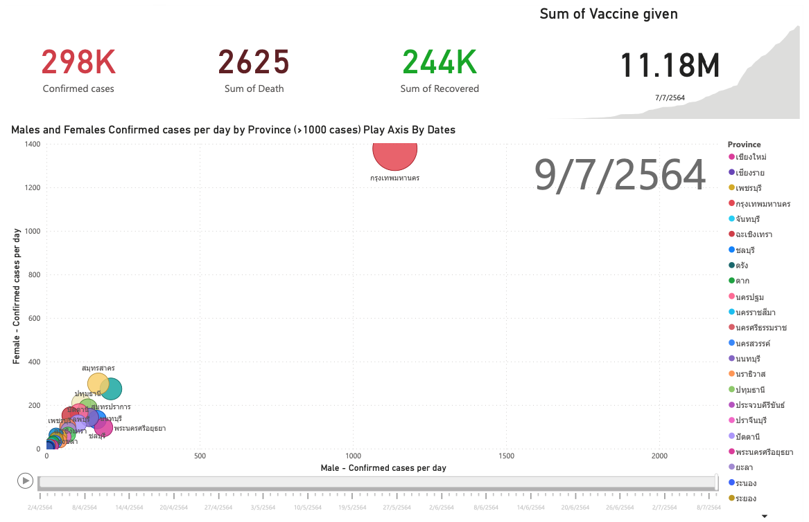
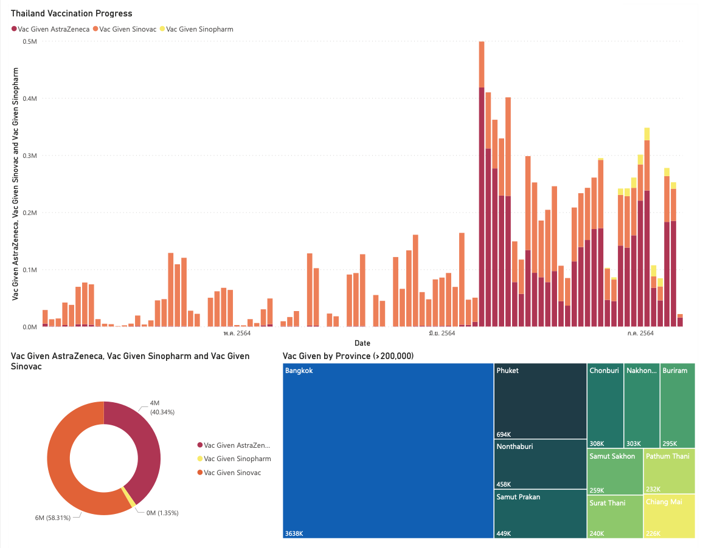
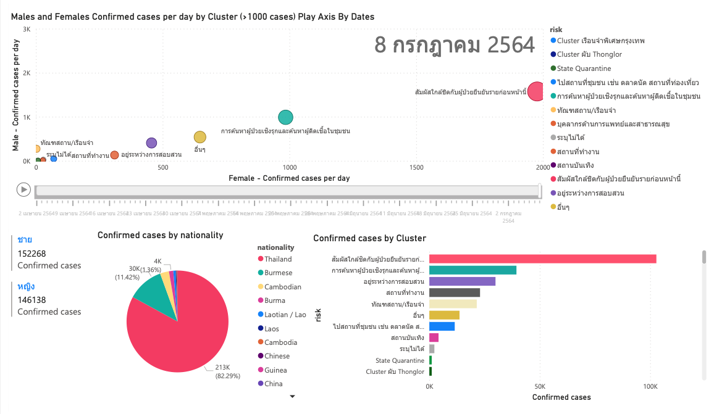
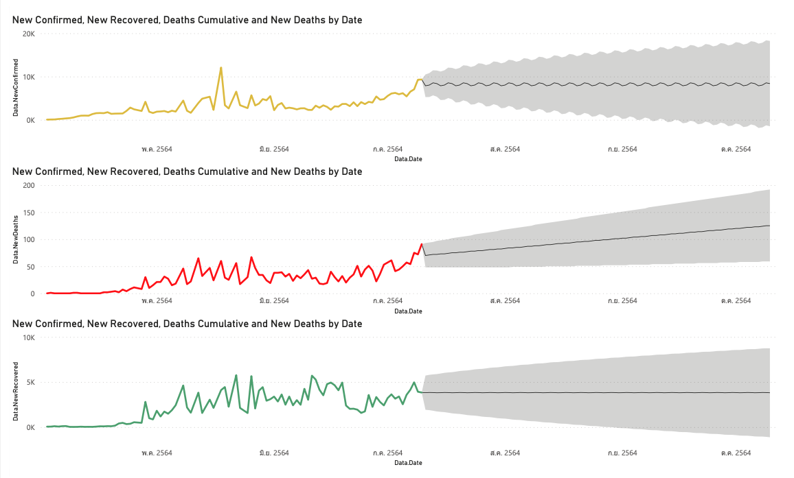
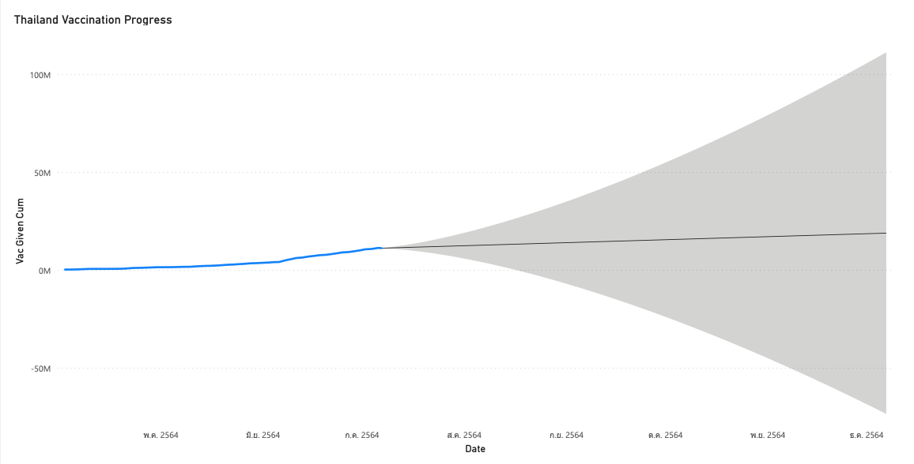

<h1 align="center" id="Covid-19 Thailand Power BI Dashboard">Covid-19 Thailand Dashboard :chart_with_upwards_trend: (Power BI Practice)</h1> 
<h3 id="(Data as of 7/7/2021)"><i>(Data as of 7/7/2021)</i></h3>

<li>
<a href="https://app.powerbi.com/view?r=eyJrIjoiMDU2YTQ0MTQtMTViMy00NjI5LThlMDctZGRiZDZmZTU2ZDkzIiwidCI6ImZkMjA2NzE1LTc1MDktNGFlNS05Yjk2LTc2YmI5Nzg4NmE4NCIsImMiOjEwfQ%3D%3D">LINK to Power BI Dashboard</a>
</li>
 

This dashboard Inspire by <a href="https://www.gapminder.org/tools/#$chart-type=bubbles&url=v1">Gapminder visualization.</a>
The data combined from various government sources and API. Daily confirmed case report from the Department of Disease Control.
Thailand Daily vaccinations data from Source: <a href="https://djay.github.io/covidthailand">https://djay.github.io/covidthailand.</a>
This dashboard was created by Power BI for practicing purposes. :smile:  The Dashboard contains:
  
 

<li>Summary of confirmed cases, death cases, recovered cases, and sum of Vaccine given</li>
<li>Males and Females Confirmed cases per day by Province (>1000 cases) Play Axis By Dates.</li>
<li>New Confirmed, New Recovered, Deaths Cumulative and New Deaths by Date</li>
<li>Thailand Vaccination Progress (by brands)</li>
<li>Vaccine Given by Province (show only the province which >200,000 doses given)</li>
<li>Males and Females Confirmed cases per day by Cluster (>1000 cases) Play Axis By Dates</li>
<li>Confirmed cases by nationality</li>
<li>Confirmed cases by Cluster</li>
<li>New Confirmed, New Recovered, Deaths Cumulative and New Deaths by Date (Simple Forecasting function in Power BI)</li>
<li>Thailand Vaccination Progress (Simple Forecasting function in Power BI)</li>
  

 
<i><b>Note:</b> Data is filtered by > 1 April 2021 and updated data as of 7 July 2021</i>

Dashboard Page 1 Can click Play! :white_check_mark:

Dashboard Page 2

Dashboard Page 3 Can click Play! :white_check_mark:

Dashboard Page 4

Dashboard Page 5

<h2 id="References Data">References Data</h2>
<ol>

<li>
<a href="https://data.go.th/dataset/covid-19-daily">Confirmed COVID-19 infections from data.go.th</a>
</li>

<li>
<a href="https://data.go.th/dataset/8a956917-436d-4afd-a2d4-59e4dd8e906e/resource/67d43695-8626-45ad-9094-dabc374925ab/download/confirmed-cases.xlsx">https://data.go.th/dataset/8a956917-436d-4afd-a2d4-59e4dd8e906e/resource/67d43695-8626-45ad-9094-dabc374925ab/download/confirmed-cases.xlsx</a>
</li>

<li>
<a href="https://covid19.th-stat.com/json/covid19v2/getTimeline.json">https://covid19.th-stat.com/json/covid19v2/getTimeline.json</a>
</li>

<li>
<a href="https://raw.githubusercontent.com/wiki/djay/covidthailand/vac_timeline.csv">https://raw.githubusercontent.com/wiki/djay/covidthailand/vac_timeline.csv</a>
</li>
<li>
<a href="https://djay.github.io/covidthailand">https://djay.github.io/covidthailand</a>
</li>

</ol>

