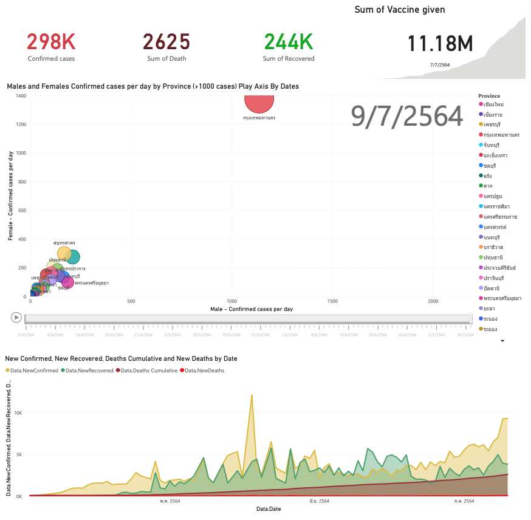

<h1 align="center" id="Covid-19 Thailand Power BI Dashboard">Covid-19 Thailand Power BI Dashboard</h1> 

<li>
<a href="https://app.powerbi.com/view?r=eyJrIjoiMDU2YTQ0MTQtMTViMy00NjI5LThlMDctZGRiZDZmZTU2ZDkzIiwidCI6ImZkMjA2NzE1LTc1MDktNGFlNS05Yjk2LTc2YmI5Nzg4NmE4NCIsImMiOjEwfQ%3D%3D">LINK to Power BI Dashboard</a>
</li>

Fig 1:

Fig 2:

Fig 3:

Fig 4:

Fig 5:/p>

<h2 id="1. User Scenario - The Characters">1. User Scenario: The Characters</h2>

<h3 id="Who is our target user?">Who is our target user?</h3>
This is my repo on recreating the Gapminder visualization using PowerBI. The question that I have know is:
"Will COVID19 alter the current trend? Will there be a significant change on this plot for the year 2020?"

<i><b>Note:</b> Data as of 7/7/2021</i>

<h3 id="Why are they important?">Why are they important?</h3>
Over the past decade, Ireland has grown into a Global Technology hub. Ireland, being the second largest exporter of computer and IT services in the world, has successfully attracted 9 of the top 10 global Information Technology companies to establish a significant presence here. As a result, there has been a great increase in the number of international students who want to pursue their career in Technology. Also, the figure of incoming international students is expected to rise even more rapidly in coming years. 
 
In the past five years, 25,000 new jobs have been announced by the Tech sector in Ireland. With almost two thousand additional graduates required by the sector every year from 2018. There are massive opportunities for students who pursue relevant third level courses. Hence, our target audience, the student community, is an important aspect in the growth of Ireland.
 

<h3 id="What problem are we solving for them?">What problem are we solving for them?</h3>
At present, there is no all-in-one platform where students could get all the information they need regarding the subject of their interest. Students willing to pursue their careers in Technology face difficulty to realize which skills are in high demand in the Irish market. We wanted to provide them details that would guide them in choosing the modules during their graduate/undergraduate studies. This would also help them study the job market and find the events happening around them related to those skills. They can also connect with like-minded people by attending events in their area.  

Information we will be providing can be divided into four categories:

- 
Events for enhancing skills and networking.

- 
Open job positions and job insights that will help them make educated decisions about their career. 
- 
Most recent news articles related to the skills.

- 
Most recent Twitter feed related to the skills.

In addition, we will provide our users with interactive dashboards containing insights gained from combination of four categories mentioned above. Some of these insights will include visualizations such as: 

- 
 Most popular Meetup group in Ireland.

- 
 Most popular events happening in Ireland.

- 
 Top IT skills in the Irish market. 

- 
 Counties having maximum number of job openings in Ireland. 

- 
 Top companies hiring in Ireland. 

- 
 Top companies in terms of work life balance rating.

- 
 Most popular Job titles in Ireland based on filtered IT skill(s). 

- 
 Highest paid jobs in Ireland based on filtered IT skill(s). 

- 
 Most difficult Job Interviews based on filtered IT skill(s). 

- 
 Top trending IT skills based on the latest News articles being published.

- 
 Trend of number of published News articles related to IT skills. 

<h2 id="References Data">7. References Data</h2>
<ol>

<li>
<a href="https://data.go.th/dataset/covid-19-daily">https://data.go.th/dataset/covid-19-daily</a>
</li>

<li>
<a href="https://data.go.th/dataset/8a956917-436d-4afd-a2d4-59e4dd8e906e/resource/67d43695-8626-45ad-9094-dabc374925ab/download/confirmed-cases.xlsx">https://data.go.th/dataset/8a956917-436d-4afd-a2d4-59e4dd8e906e/resource/67d43695-8626-45ad-9094-dabc374925ab/download/confirmed-cases.xlsx</a>
</li>

<li>
<a href="https://covid19.th-stat.com/json/covid19v2/getTimeline.json">https://covid19.th-stat.com/json/covid19v2/getTimeline.json</a>
</li>

</ol>
